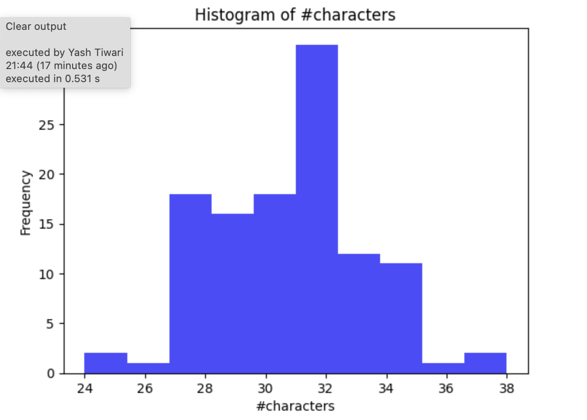

# ASRDataMaker
A repo consisting of the scripts to scrape ASR data from NPTEL site

# Installation

### clone repo and go to the working directory
` git clone https://github.com/yashtiwari1906/ASRDataMaker.git` 

`cd ASRDataMaker`

make a virtual env and intall the dependencies 
`pip install -r requirements.txt`

## CAUTION:
Install ffmpeg first in the sudo mode as yt-dlp needs to access it for ubuntu `sudo apt-get install ffmpeg` and for macOS `brew install ffmpeg`

# Quick Demo 

There is a file tathastu.py which contains master logic for running all files so you just need to provide a course_url and number of data points you want to download for this demo

`python tathastu.py -cu <course_url> -n <num_samples>` 

`python tathastu.py -cu "https://nptel.ac.in/courses/106106184" -n 20`

# Usage

## Task1
Note: 

1.) in the scripts there is a main function which takes Course URL as input and process the download if you want these for different course change the url 

2.) add -n <num_sample> to limit the sample size

#### Audio Download
downloading audios only with the name of the audio as lesson{lesson_id}.mp3 into a folder named Audios all files will be in mp3 format. for default Deep Learning course first command will work but if you want to download it for different course you need to provide the URL for couse 

`python task1/audioDownload.py` 

`python task1/audioDownload.py -cu <course_url> -n <num_sample>`

#### PDF Transcripts
downloading all the transcripts pdfs for the audios names as lesson{lesson_id}.pdf into a folder named pdf_transcripts all files will be in pdf format. for default Deep Learning course first command will work but if you want to download it for different course you need to provide the URL for couse

`python task1/transcriptsDownload.py`

`python task1/transcriptsDownload.py -cu <course_url> -n <num_sample>`

#### Observations & answers for query
* It's working for courses https://nptel.ac.in/courses/106106182 (The Joy of Computing) & https://nptel.ac.in/courses/101108086 (Gasdynamics: Fundamentals and Applications) (checked for 50 data points only)
* Looks like script is robust and can download data given an URL although not tested for other courses present in the website but if any single section is maintaining the hosting of course then there is very high chances that this script can download paired data given the URL.
* right now there is two different scripts but they can be utilized in parallel to reduce the download time.

## Task2
#### Bash Script - Parallel processing
firslty you need to make this bash script executable by doing `chmod +x ./task2/audio_converter_parallel.sh` then run below command

`./task2/audio_converter_parallel.sh  <audio_input_folder> <output_folder> <num_cpus>`

If you have executed the task1 scripts then you can use below command for testing 

`./task2/audio_converter_parallel.sh  ./task1/Audios/ task2/parallel_processed_audios 6`

#### Python script for super clean speech audio
run following command to process the audio and remove the music present in the begining and at the end just need to provide the path where auidos are there which you want to remove music also a non-mandatory arguement (-pfp) which essentially means where you want to store the processed audio files

`python task2/musicRemoval.py -afp <input_audio_folder_path> -pfp <storage_folder_path_processed_audio>`

if you have ran the above bash script then you can run the command below and all your processed audio will be saved under super_cleaned_audios

`python task2/musicRemoval.py -afp task2/parallel_processed_audios/`

#### Observations & answers for query
* for music removal from the auios one thing to notice is starting intro music was same ie. 11 seconds i all audios so we got the start_time and for last_time it's worth giving thought that music must be having many audio features different then speech audio for eg. frequency, energy, timbre(may be since music looks like brighter then speech signal) but one experiment(not mine but from internet) resulted good result energy of the music part will be greater than 0.1 this performed very well btw I would had time I would have gone for audio exploration, may be taking a look on spectral features for both the audio segment, etc so we can chop audio from start_time to end_time and your final audio is ready
* just to mention parallely processed files were significantly faster by a large factor 

## Task3
#### converting text -> pdf
so two commands are there first is if you have already ran your task1 and have your pdf files in it's default folder and second one when you want to provide a folder path for the pdf_files and another folder_path where you want your text_files to be saved

`python task3/pdf2text_converter.py`

`python task3/pdf2text_converter.py -pfp <pdf_folder_path> -tfp <text_folder_path>`

#### Fine details
I have also stored multiple json in transcripts_fine_details which is nothing but transcripts corresponding to a time-interval using (refer slide time : 00:00) from text transcript which can help in making the data robust of the audio lengths by including equal distribution from all lengths.

#### Observations & answers for query
* num2words performed well but still it was not 100% accurate maybe it face difficulty in decoding numbers when they were not standalone
* there was some meta data in the text files regarding the Institute, course, chapter, etc information and time stamps were written I've tackled this with ad-hoc methods since text was structured

## Task4
#### train manifest jsonl file 
If your'e following sequentially only thing you need to do is 

`python task4/prepareManifestFile.py`

if you have audio_files and transcripts_files in different then you might need to provide the paths otherwise default path will be used

`python task4/prepareManifestFile.py -afp <audio_files_folder> -tfp <transcripts_files_folder>`

## Task5

### Global Statistics

| Header 1          | Header 2 |
|-------------------|----------|
| total number hours|  27.276
| total number utterances|  114
| Vocabulary size |  6023  
| character size |   50  

All characters in the file are:

['2', '\uf073', 'p', 'c', 'f', '\uf061', '3', '\uf02b', 'z', ',', 'w', 'y', 'b', '\uf0b4', 'n', '’', '\uf071', '0', 't', 'h', 's', '1', 'x', 'q', 'j', '7', '\uf0b6', 'o', 'd', 'm', '5', 'l', '“', 'u', '9', '4', '6', '-', 'a', 'v', '–', 'k', '‘', 'r', '8', 'g', 'i', 'ˆ', 'e', ' ']

### Histograms

  
   
  

# Future Work
* num2words processing was not upto the mark it left some unnecessary characters in the files may it faced problems when numbers were not standalone
* making many other scripts parallel as well as utilizing asynchronous programming in some places to boost up the process
* A remember mechanism may be simple json file by which we can start where we left last 
* Becuase internet issues 2-3 audios got left behind due connection errors or may be further debug why it happened with them

